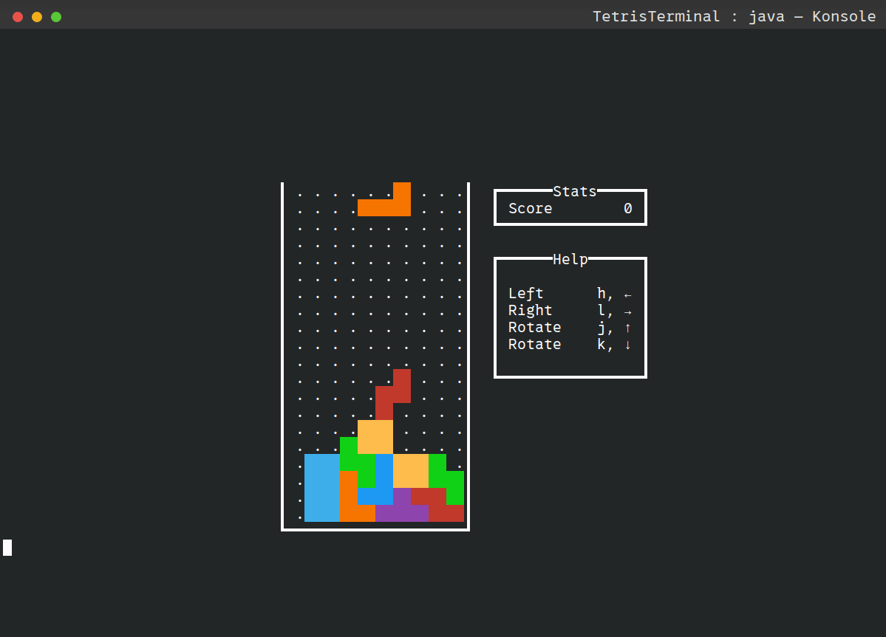

# 🎮 Terminal Tetris (Java)

A classic Tetris game played entirely in the terminal, written in Java.
Fast, lightweight, and runs on Windows, macOS, and Linux.

## ✨ Features

- Classic Tetris gameplay in the terminal
- Real-time controls using arrow keys
- Cross-platform support (Windows / macOS / Linux)
- Lightweight and fast


## 🖥️ Build & Run

### Requirement
- **Java 17**
- **Apache Maven 3.8.7**


### Steps
1. Clone the repository:
```bash
 git clone https://github.com/jaikarans/tetris-for-terminal.git
```
2. Go to root:
```bash
cd tetris-for-terminal
```
3. Run the game:
```bash
mvn clean compile exec:java
```


## ❤️ Credits

Inspired by the original Tetris by Alexey Pajitnov

[MIT](https://choosealicense.com/licenses/mit/)